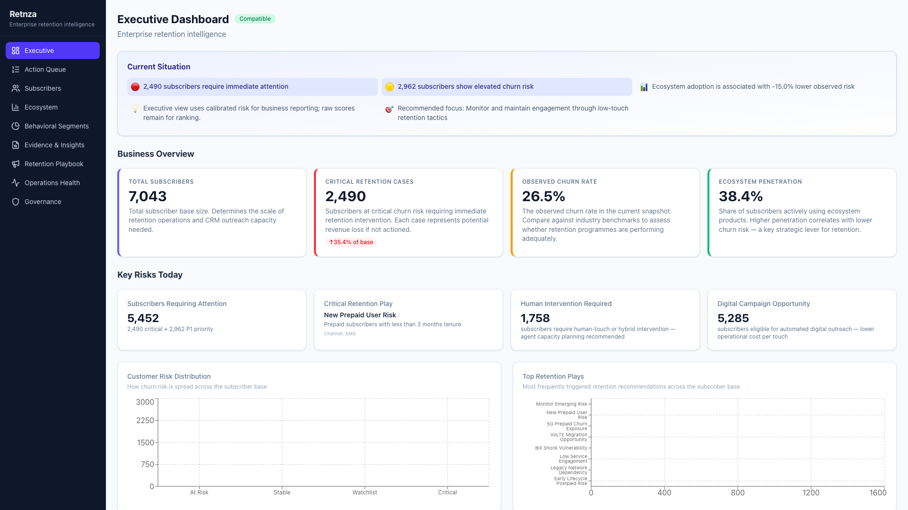
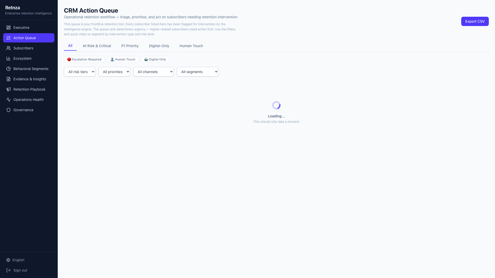
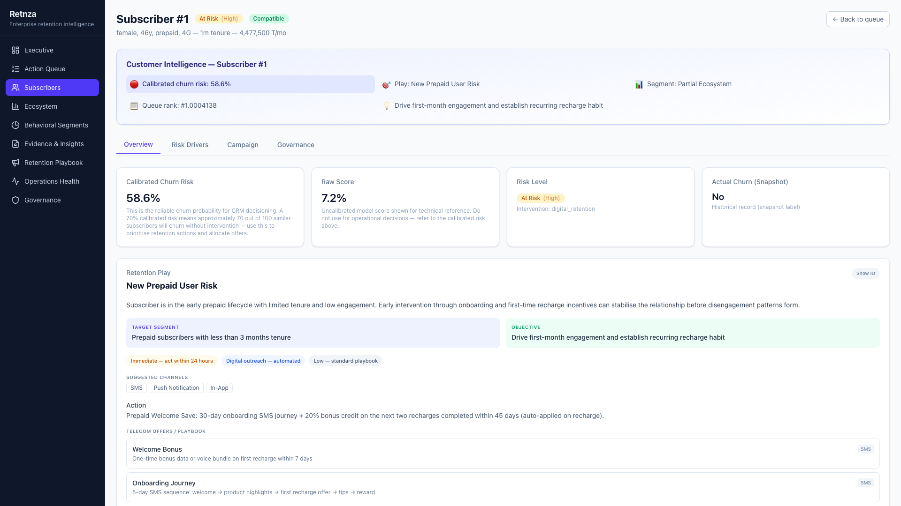
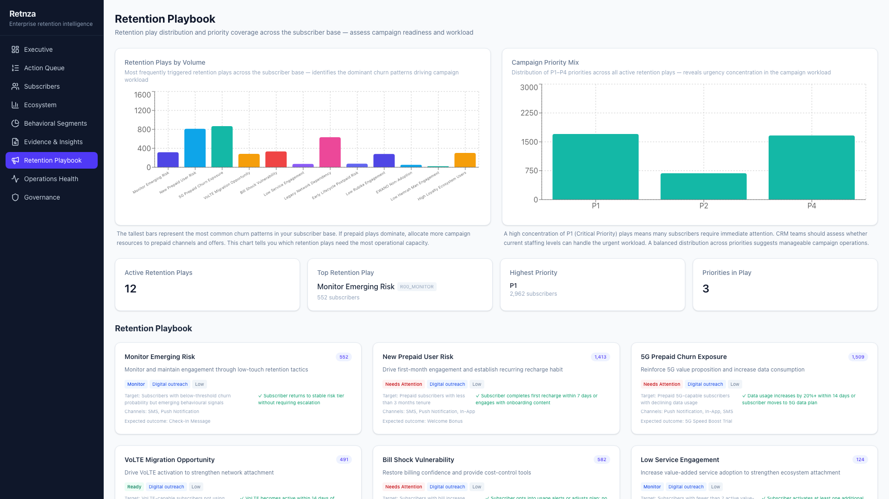
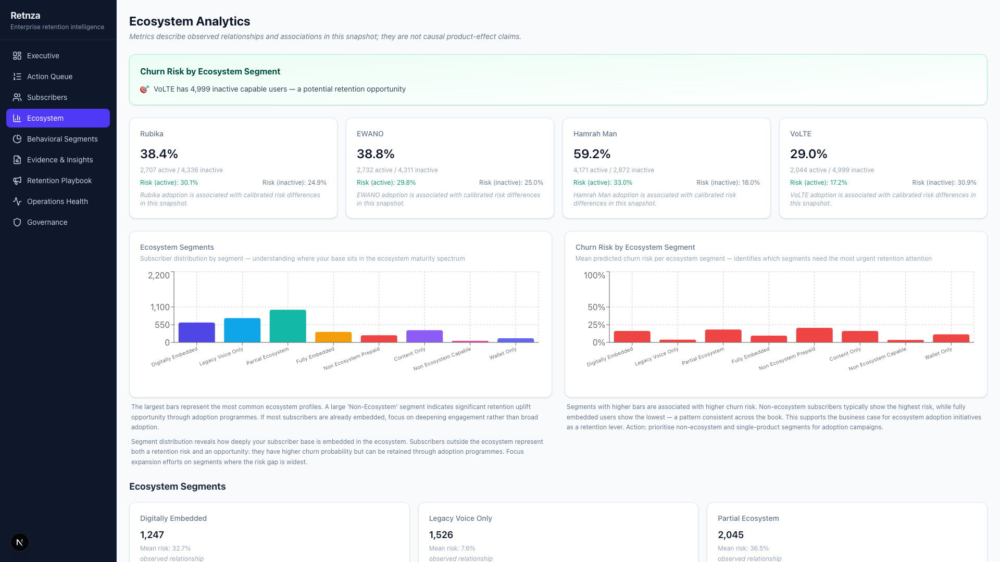
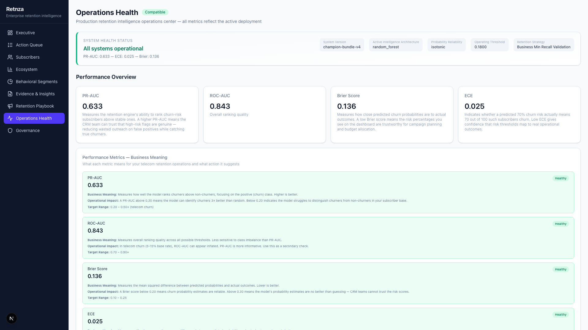
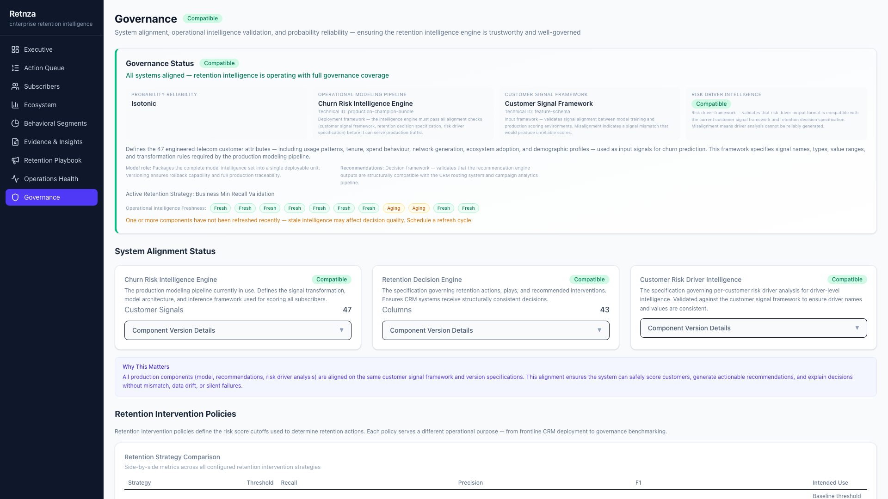
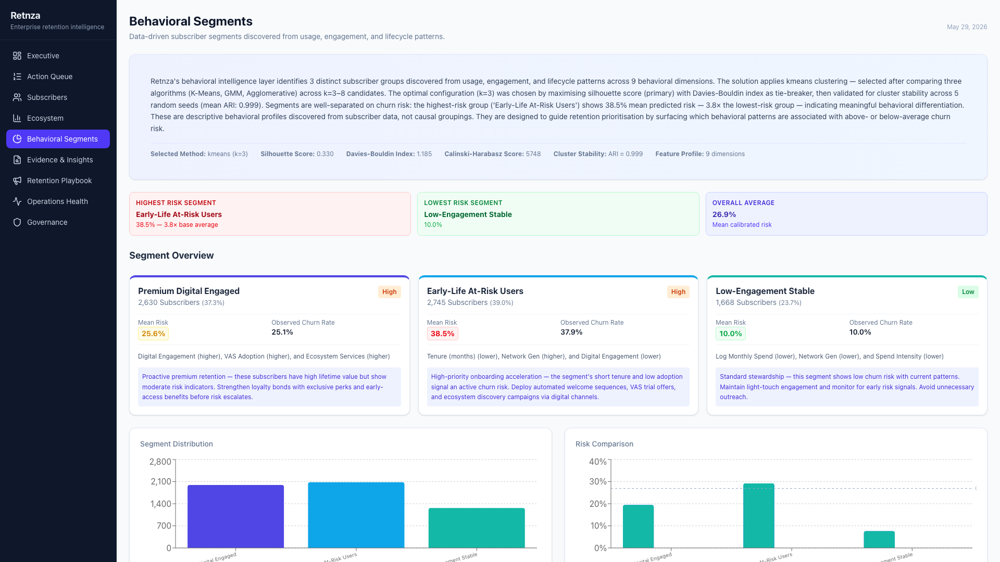
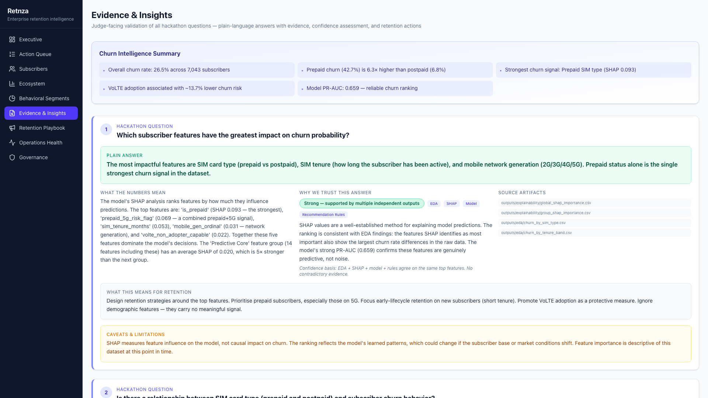

# رتنزا — سکوی هوشمند مدیریت ماندگاری مشترکین مخابرات

**ریزش را کاهش بده. دلیل را توضیح بده. اقدام را توصیه کن.**

رتنزا یک سکوی سازمانی برای پیش‌بینی ریزش و پشتیبانی از تصمیم‌گیری ماندگاری مشترکین مخابرات است. این سکو مشترکین در معرض ریزش را شناسایی می‌کند، دلیل ریزش را با تحلیل SHAP توضیح می‌دهد، اقدامات ماندگاری را از طریق ۱۴ قانون تجربی توصیه می‌کند، و نتایج را در یک داشبورد تعاملی دوزبانه (فارسی/انگلیسی) با ۹ نمای عملیاتی ارائه می‌دهد.

---

## نمای کلی

| لایه | فناوری | وضعیت |
|------|--------|--------|
| خط لوله ML | Python (scikit-learn, SHAP) | **تکمیل** — ۴۷ ویژگی، مدل Random Forest، کالیبراسیون Isotonic |
| موتور توصیه | Python — ۱۴ قانون قطعی | **تکمیل** — نرخ بازگشت ۰٪، ۴ قانون زیست‌بوم |
| بک‌اند API | FastAPI + SQLAlchemy + PostgreSQL | **تکمیل** — ۲۰ نقطه پایانی، احراز هویت JWT |
| داشبورد فرانت‌اند | Next.js 15 + TypeScript + Recharts | **تکمیل** — ۹ صفحه، دوزبانه، ۱۶۹ تست |
| خروجی BI | CSV + Parquet | **تکمیل** — صف اقدام CRM، مانیفست Power BI |
| استقرار | Docker Compose | **تکمیل** — PostgreSQL 16, Redis 7 |

---

## مسئله

اپراتورهای مخابراتی سالانه ۲۰–۳۰٪ مشترکین خود را از دست می‌دهند. تیم‌های ماندگاری باید بدانند **کدام** مشترک در معرض ریزش است، **چرا**، و **چه باید کرد**.

رتنزا به چهار سؤال پاسخ می‌دهد:

| سؤال | پاسخ |
|------|------|
| **کدام** مشترک در معرض ریزش است؟ | موتور ریزش هر مشترک را با احتمال کالیبره‌شده ارزیابی می‌کند |
| **چرا** در معرض ریزش هستند؟ | تحلیل SHAP سیگنال‌های خاص ریزش را مشخص می‌کند |
| **چه** باید کرد؟ | ۱۴ قانون تجربی، ریسک + مشخصات را به اقدام ماندگاری تبدیل می‌کند |
| **چگونه** اقدام کنیم؟ | صف اقدام CRM، کمپین‌ها، تحلیل زیست‌بوم، خروجی BI |

---

## معماری

```
CSV خام → پاک‌سازی → مهندسی ویژگی (۴۷) → مدل قهرمان (RF) → کالیبراسیون (Isotonic)
                                                         ↓
                    تفسیرپذیری SHAP ← نمره‌دهی ریسک + سطح‌بندی
                                                         ↓
                                        موتور قانون (R01–R13)
                                                         ↓
                              بخش‌بندی رفتاری (K-Means / ۳ خوشه)
                                                         ↓
                                    ┌──────────────────────────┐
                                    │  FastAPI (REST + JWT)     │
                                    │  PostgreSQL (مصنوعات)     │
                                    └──────────────────────────┘
                                                         ↓
                                ┌───────────────────────────┐
                                │  داشبورد Next.js (EN/FA)   │
                                │  صف اقدام CRM              │
                                │  بخش‌های رفتاری            │
                                │  کمپین / زیست‌بوم          │
                                │  حاکمیت / سلامت            │
                                └───────────────────────────┘
                                                         ↓
                                      خروجی CSV / Parquet
```

---

## نحوه اجرا

### پیش‌نیازها

- Python 3.11+، Node.js 20+، Docker
- ۴ گیگابایت فضای خالی برای مصنوعات ML

### ۱. اجرای خط لوله کامل

```bash
python3 -m venv .venv
source .venv/bin/activate
pip install -r requirements.txt

python scripts/build_datasets.py
python scripts/build_features.py
python scripts/train_champion.py
python scripts/generate_recommendations.py
python scripts/export_powerbi_dataset.py
```

### ۲. راه‌اندازی سکو

```bash
docker compose -f docker/docker-compose.yml up postgres redis -d
python backend/scripts/seed_db.py
cd backend && uvicorn app.main:app --reload --port 8000

# ترمینال جداگانه
cd frontend && npm install && npm run dev
```

### ۳. دسترسی به داشبورد

| آدرس | توضیح |
|------|--------|
| http://localhost:3000 | داشبورد |
| http://localhost:8000/docs | مستندات API |
| ورود: `admin@retnza.local` / `admin123` | |

---

## صفحات داشبورد

### ۱. داشبورد اجرایی

*شاخص‌های کلیدی: تعداد مشترکین، نرخ ریزش، اقدامات P1، توزیع ریسک، اولویت‌های کمپین.*

### ۲. صف اقدام CRM

*اقدامات ماندگاری اولویت‌بندی‌شده با فیلتر بر اساس سطح ریسک، اولویت، بخش زیست‌بوم.*

### ۳. اطلاعات مشترک

*نمره ریسک + راننده‌های SHAP + توصیه + مشخصات زیست‌بوم + فراداده کمپین.*

### ۴. کتابچه کمپین

*معیارهای عملکرد کمپین، تحلیل اشباع، پیش‌بینی تأثیر تاریخی.*

### ۵. تحلیل زیست‌بوم

*پذیرش محصول (روبیکا، ایوانو، همراه‌من، VoLTE)، سطوح تعامل، استراتژی‌های ماندگاری.*

### ۶. سلامت مدل

*تشخیص رانش (PSI)، معیارهای پایداری، توزیع نمرات.*

### ۷. نظارت و حاکمیت مدل

*معیارهای قهرمان، مقایسه خط‌مشی آستانه، پانل اعتماد ۱۰ موردی.*

### ۸. بخش‌بندی رفتاری

*۳ خوشه K-Means با نیمرخ، اهمیت ویژگی، تمایز ریسک.*

### ۹. شواهد و بینش

*اهمیت جهانی SHAP، تشخیص قوانین، مصنوعات تفسیرپذیری.*

---

## نتایج کلیدی

### عملکرد مدل (آزمون)

| معیار | مقدار |
|-------|--------|
| PR-AUC (کالیبره‌نشده) | ۰.۶۵۷ |
| ROC-AUC | ۰.۸۴۴ |
| Brier (کالیبره‌شده) | **۰.۱۳۶** |
| ECE (کالیبره‌شده) | **۰.۰۲۵** |
| بازیابی عملیاتی | **۸۶.۸٪** |
| Lift دهک برتر | **۲.۸۰×** |

### توزیع ریسک

| سطح | آستانه | تعداد | درصد |
|-----|--------|-------|------|
| بسیار بالا | ≥۰.۶۵ | ۶۶۴ | ۹.۴٪ |
| بالا | ≥۰.۳۰ | ۱,۸۲۶ | ۲۵.۹٪ |
| متوسط | ≥۰.۱۵ | ۱,۶۶۴ | ۲۳.۶٪ |
| کم | <۰.۱۵ | ۲,۸۸۹ | ۴۱.۰٪ |

### قوانین برتر

| قانون | تعداد | درصد |
|-------|-------|------|
| R02_PREPAID_5G | ۱,۵۰۹ | ۲۱.۴٪ |
| R01_PREPAID_INFANT | ۱,۴۱۳ | ۲۰.۱٪ |
| R07_LEGACY_2G | ۱,۱۰۱ | ۱۵.۶٪ |
| R05_BILL_SHOCK | ۵۸۲ | ۸.۳٪ |
| R00_MONITOR | ۵۵۲ | ۷.۸٪ |

---

## بخش‌بندی رفتاری

### سه بخش

| بخش | اندازه | ریسک متوسط | ریسک نسبت به میانگین | درمان |
|-----|--------|-----------|-------------------|--------|
| کاربران ابتدای چرخه | ۲,۷۴۵ (۳۹.۰٪) | ۰.۳۸۵ | **۱.۴۳×** (بالاترین) | تسریع عضوگیری زیست‌بوم |
| کاربران برتر دیجیتال | ۲,۶۳۰ (۳۷.۳٪) | ۰.۲۵۶ | ۰.۹۵× | مزایای وفاداری |
| پایدار با تعامل کم | ۱,۶۶۸ (۲۳.۷٪) | ۰.۱۰۰ | **۰.۳۷×** (پایین‌ترین) | نظارت دوره‌ای |

**نسبت ریسک (بالاترین/پایین‌ترین): ۳.۸×**

---

## محدودیت‌ها

- **بدون اعتبارسنجی زمانی** — مجموعه داده تک‌عکس فوری
- **بدون استنتاج علی** — توصیه‌ها مبتنی بر قانون هستند
- **حجم داده متوسط** — ۷,۰۰۰ مشترک
- **کش Redis**: پیکربندی اما پیاده‌سازی نشده
- **SHAP فقط روایی است** — اقدامات را انتخاب نمی‌کند
- **بدون تست بار** برای نقاط پایانی داشبورد

---

## مجموعه داده

- **۷,۰۴۳ مشترک**، نرخ ریزش تاریخی ~۲۶.۵٪
- **۴۷ ویژگی مهندسی‌شده** از صورتحساب، مصرف و محصولات
- منبع: `MCI_Challenge_FinalDataset.csv`
- تمام مقادیر مالی به تومان ایران

---

## بلوغ مهندسی

**مرحله ۴: معماری منسجم** — جداسازی وظایف در ۷ مرحله خط لوله، مصنوعات با نسخه‌بندی، پوشش تست جامع، رابط کاربری دوزبانه، مبادلات مهندسی مستند.
