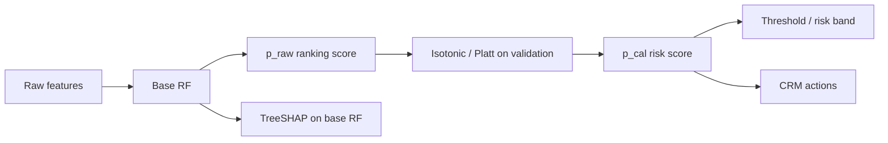

# Champion Model

## Champion choice

Tuned **Random Forest** (`class_weight=balanced`), consistent with baseline contact baseline. Hyperparameters selected via `RandomizedSearchCV` on train with **PR-AUC** as the tuning metric.

## Split discipline

| Split | Role |
|-------|------|
| Train (70%) | RF hyperparameter search |
| Validation (15%) | Calibrator fit, threshold selection |
| Test (15%) | Final acceptance only |

## Scoring pipeline



**Critical implementation rule:** the calibrator is fit on **validation raw probabilities** `(p_val_raw, y_val)`, not on `X`.

```python
from modeling.scoring import predict_raw_proba, calibrate_raw_proba

p_raw = predict_raw_proba(bundle, X)   # base RF only
p_cal = calibrate_raw_proba(bundle, p_raw)  # isotonic / Platt on scalars
```

**Anti-pattern:** `isotonic.predict(X)` or treating the calibrator as a second feature-based model.

The `ProbabilityCalibrator` wrapper still supports `predict_proba(X)` for convenience; internally it always does `p_raw` then `calibrate_probabilities(p_raw)`.

## Dual outputs (not a contradiction)

| Output | Source | Use |
|--------|--------|-----|
| `churn_probability_raw` | `base_model.predict_proba[:, 1]` | Ranking, queue sort, PR-AUC monitoring |
| `churn_probability` (calibrated) | `calibrate_raw_proba(bundle, p_raw)` | Risk tiers, thresholds, stakeholder-facing % |

Isotonic (or Platt) typically **improves Brier and ECE** while **PR-AUC may dip slightly** on test. That is expected: calibration targets probability truthfulness, not rank order.

## Calibration selection

Among `none`, `sigmoid`, and `isotonic`, pick the method within **1pp validation PR-AUC** of the best, then **lowest validation Brier**.

## Operating policies

| Policy | Role |
|--------|------|
| **`business_min_recall_validation`** | **Primary** — lowest threshold with recall ≥ 0.75 and precision ≥ 0.50 on validation when feasible (baseline alignment) |
| `max_f1_validation` | Balanced default; campaign owners may override for contact budget or FN cost |
| `min_recall_0.75_validation` | Recall floor without precision constraint |
| `top_decile_validation_score` | Fixed contact-budget proxy (top 10% by calibrated score on validation) |

**max-F1** is documented as a **balanced reference**, not the sole business rule. Overrides: contact budget, cost per save, false-negative cost.

## Risk bands (Power BI) — on calibrated probability

| Tier | Calibrated P(churn) ≥ |
|------|------------------------|
| Very High | 0.65 |
| High | 0.30 |
| Medium | 0.15 |
| Low | &lt; 0.15 |

## Downstream (SHAP & recommendations)

- **SHAP:** `TreeExplainer` on **`base_model`** only.
- **Recommendations:** rules and tiers on **`p_cal`**; drivers from SHAP on base RF.
- **Power BI:** sort/rank by raw score or decile; labels and KPI tiles by calibrated tier.

## Reproduce

```bash
.venv/bin/python scripts/train_champion.py
```

Artifacts: `outputs/champion/champion_model.joblib`, `champion_manifest.json` (`schema_version`: `production-champion-bundle`).
