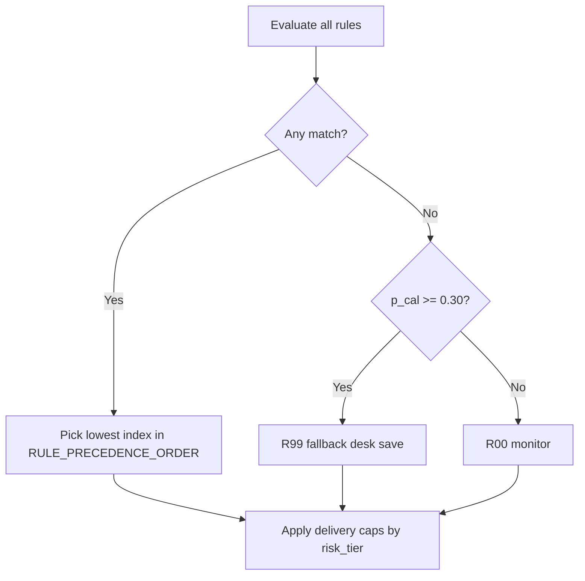

# Recommendation Engine

## Engine type

**Rule-based prioritization** on calibrated churn risk + product flags. This is **not** uplift modeling or causal treatment-effect estimation. Rules encode EDA + SHAP-informed hypotheses as **auditable** campaigns.

## Pipeline

```text
p_cal → risk_tier → product rules (precedence) → optional SHAP narrative → delivery caps by tier
```

## Risk tiers (operational, not universal)

| Tier | Calibrated P(churn) ≥ | Rationale |
|------|------------------------|-----------|
| Very High | 0.65 | ~top 5–10%; immediate save capacity |
| High | 0.30 | ~top 30%; aligns with recall-oriented contact policy |
| Medium | 0.15 | Digital nurture |
| Low | 0.00 | Monitor |

These cutpoints assume **current prevalence**, **isotonic calibration**, and an implicit **CRM contact budget** (~30% of book). Re-tune when any of those change. They are **not** Bayes-optimal or industry-standard constants.

## Rule precedence (when multiple fire)



**Order:** R01, R02, R12, R03, R04, R05, R06, R07, R08, R09, R10, R11, R13, R00, R99.

### Example 1 — Prepaid infant + 5G

- Flags: `is_prepaid=1`, `sim_tenure_months≤6`, `prepaid_5g_risk_flag=1`
- Both R01 and R02 fire → **R01 wins** (higher precedence)
- Campaign: Prepaid Welcome Save (SMS / app), not generic 5G pack

### Example 2 — High risk, no product rule

- `p_cal ≥ 0.30`, no R01–R13 match → **R99_HIGH_RISK_SAVE**
- **Fallback only** — retention desk call (C4). Monitor `fallback_rule_share` in manifest; should stay a minority of the book.

### Example 3 — Low-risk 2G legacy

- `is_data_capable=0` → **R07_LEGACY_2G** (migration SMS) or **R13** legacy 2G no-data
- `risk_tier=Low` → `intervention_type=digital_retention`, `human_touch_flag=False`, cost **C1**
- **Action assigned** ≠ **high-touch human** intervention

## Output columns

| Column | Meaning |
|--------|---------|
| `churn_probability` | Calibrated risk (tiers, rules) |
| `churn_probability_raw` | RF ranking score |
| `rule_id` | Winning campaign rule |
| `campaign_priority` | P1–P4 queue band |
| `campaign_cost_tier` | C0–C4 spend band |
| `primary_channel` | SMS \| USSD \| app_push \| desk_call |
| `intervention_type` | monitor_only \| digital_retention \| high_touch_human |
| `human_touch_flag` | True only when desk path allowed and tier High/Very High |

## Cost tiers

| Tier | Meaning |
|------|---------|
| C0 | Monitor / health SMS only |
| C1 | Automated SMS / app (no agent) |
| C2 | USSD / digital bundle / auto-credit |
| C3 | Optional outbound call queue |
| C4 | Retention desk + ARPU-capped save |

Low/Medium risk **caps** cost and blocks desk calls even when R04–R07 fire.

## Reproduce

```bash
.venv/bin/python scripts/generate_recommendations.py
```

See `outputs/recommendations/recommendation_manifest.json` for `sample_subscribers`, `fallback_rule_share`, and full rule catalog.
